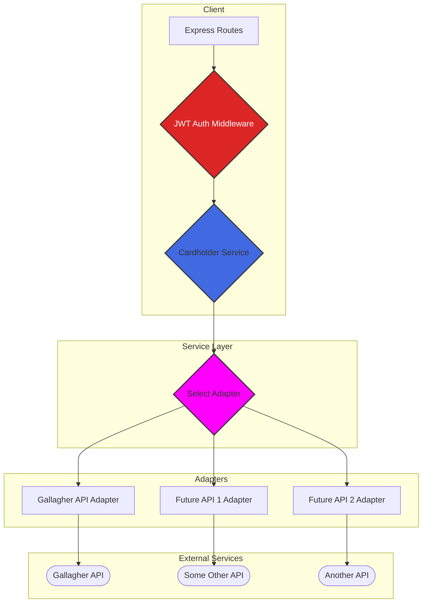
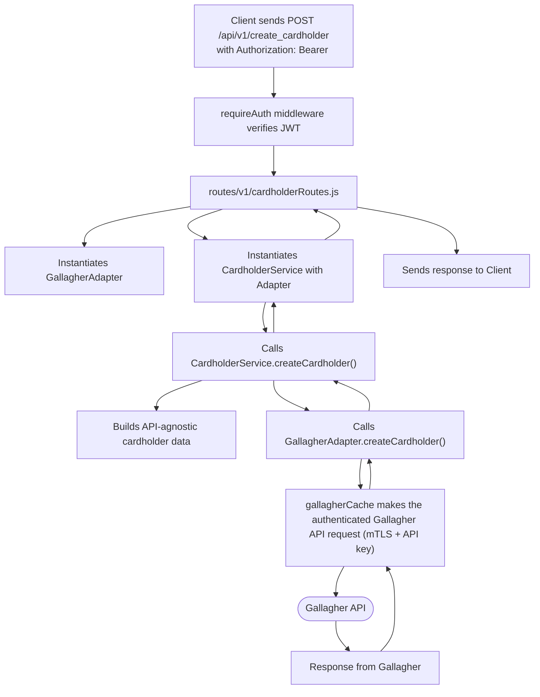
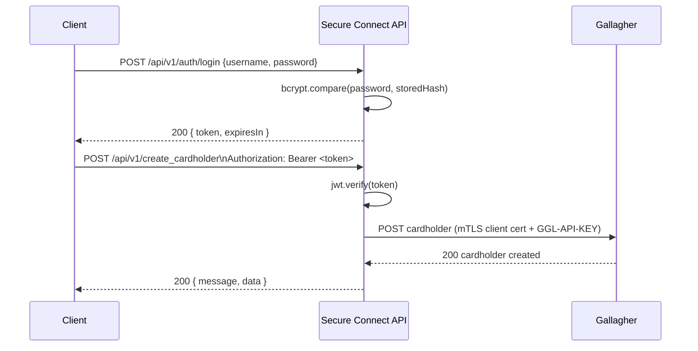

# Secure Connect

**Secure Connect** is a Node.js/Express middleware API that automates physical access control by integrating with the **Gallagher** security and monitoring platform. It exposes simplified, versioned, **JWT-protected** REST endpoints for managing cardholders — onboarding, credential (Access/MSIC card) issuance, access-group assignment, updates, and offboarding — instead of provisioning each one by hand in Gallagher's admin console.

The integration itself is built behind a **Service + Adapter pattern**, so Gallagher is treated as one pluggable backend rather than a hardcoded dependency — additional access-control vendors could be added without touching the core cardholder logic.

## Why this exists

Manually provisioning physical access (creating a cardholder, issuing a card, assigning them to the correct access group, later revoking a lost card) in a vendor console doesn't scale and isn't auditable. Secure Connect turns that workflow into a small set of authenticated REST calls, with structured, PII-redacted logging for every request so actions are traceable after the fact.

## Key Features

- **JWT authentication** — every cardholder/cache-management endpoint requires a valid `Authorization: Bearer <token>` issued by `POST /api/v1/auth/login`. Passwords are stored as bcrypt hashes; login attempts are rate-limited per IP to slow brute-force attempts.
- **Gallagher integration** — mutual-TLS (client certificate) plus API-key authentication to Gallagher's REST API, with an in-memory cache of resource hrefs (cardholders, divisions, access groups, operator groups) to minimize discovery calls.
- **Service + Adapter architecture** — business logic (`services/CardholderService.js`) is decoupled from the vendor-specific client (`api/gallagher/GallagherAdapter.js`), so new integrations can be added by implementing the same adapter interface.
- **Request validation** — Zod schemas validate every incoming payload (card types, card-number format, ISO date ordering, required fields) and return structured 400 errors.
- **Structured, audit-ready logging** — Winston with daily-rotating file transports, correlation IDs propagated across a request's lifecycle, and automatic redaction/masking of names, emails, and card numbers in logs.
- **API versioning** — all routes are namespaced under `/api/v1` to allow non-breaking evolution.
- **Dockerized** — ships with a `Dockerfile` for containerized deployment.
- **API console** — a React + Material UI + Vite front end (with a Monaco JSON editor) for exercising every endpoint, including the login flow.

## Architecture



### Data Flow — creating a cardholder



### Authentication Flow



## How to Integrate a New Access-Control API

The Adapter Pattern makes it straightforward to add another vendor alongside Gallagher:

1. **Create a new adapter** in `api/<vendorName>/<VendorName>Adapter.js`, implementing the same public methods as `GallagherAdapter.js` (`createCardholder`, `updateCardholder`, `deleteCardholder`, `findCardholderHrefByFirstName`, `findDivisionHrefByName`, `findCardNumberHref`).
2. **Implement the adapter's HTTP/auth logic** for that vendor's API.
3. **Wire it into the routes** in `routes/v1/cardholderRoutes.js`, selecting an adapter based on a header, query parameter, or body field.

## Project Structure

```
server.js                        Express app setup, middleware, versioned routing
middlewares/
  auth.js                        JWT signing (signToken) and verification (requireAuth)
  validation.js                  Zod schemas for cardholder, delete, and login payloads
services/
  CardholderService.js           API-agnostic cardholder business logic
api/
  gallagher/GallagherAdapter.js  Gallagher-specific implementation of the adapter interface
routes/v1/
  authRoutes.js                  POST /login — issues JWTs, rate-limited
  cardholderRoutes.js            Create/update/delete cardholder (JWT-protected)
  cacheRoutes.js                 Cache status/clear/inspect (JWT-protected)
utils/
  gallagherCache.js              Caches Gallagher hrefs and makes authenticated requests
  certificateLoader.js           Builds the mTLS-enabled axios client for Gallagher
  cardBuilder.js                 Builds card payloads for Access/MSIC card types
  logger.js                      Winston logging, correlation IDs, PII redaction
  errorHandler.js                asyncHandler wrapper for route handlers
config/
  gallagher.js                   Gallagher card-type IDs and base URL
  secrets.env.example            Documented env var template (copy to secrets.env)
  secrets.env                    (gitignored) actual local secrets
certificates/                    (gitignored) Gallagher mTLS client certificate files
ui/                              React/Vite/MUI API console for exercising the endpoints
```

## Setup

1. **Clone the repository**
   ```bash
   git clone https://github.com/souravsharm/Secure-Connect.git
   cd Secure-Connect
   ```

2. **Install dependencies**
   ```bash
   npm install
   cd ui && npm install && cd ..
   ```

3. **Configure environment variables**

   Copy the template and fill in real values:
   ```bash
   cp config/secrets.env.example config/secrets.env
   ```

   At minimum you'll need:
   ```
   PORT=3000

   # JWT auth (this app's own auth layer)
   JWT_SECRET=<generate with: node -e "console.log(require('crypto').randomBytes(32).toString('hex'))">
   JWT_EXPIRES_IN=1h
   AUTH_USERNAME=admin
   AUTH_PASSWORD_HASH=<generate with: node -e "console.log(require('bcryptjs').hashSync('yourPassword', 10))">

   # Gallagher API
   GALLAGHER_API_URL=https://your-gallagher-server:8904
   GALLAGHER_API_KEY=your_gallagher_api_key
   CLIENT_CERT_PATH=../certificates/GallagherRestClientCert.pfx
   CERT_PASSPHRASE=your_certificate_passphrase
   ```

4. **Certificates folder**

   Create a `certificates/` folder at the project root and place your Gallagher mTLS client certificate (`.pfx`) inside. This folder is gitignored — never commit certificate files.

5. **Run the server**
   ```bash
   npm run dev
   ```

6. **Run the API console (optional)**
   ```bash
   cd ui
   npm run dev
   ```

## API Reference (`/api/v1`)

### Authentication

#### Login
- `POST /api/v1/auth/login` — **public**, rate-limited (5 attempts / 15 min / IP)
- Body:
  ```json
  { "username": "admin", "password": "yourPassword" }
  ```
- Response:
  ```json
  { "token": "<jwt>", "tokenType": "Bearer", "expiresIn": "1h" }
  ```
- All routes below require `Authorization: Bearer <token>` from this response.

### Cardholder Management

Validation rules are unified across create/update/delete via `validatePersonBody` in [routes/v1/cardholderRoutes.js](routes/v1/cardholderRoutes.js). The request body must be an object with a top-level `person` key.

**Cardholder schema (`person`)**
- Required: `firstName` (non-empty), `cards` (array, min 1)
- Optional: `lastName`, `email` (valid email), `divisionName`, `employmentCategory`, `photo` (base64 JPEG, raw or data URI)

**Card schema (each item in `cards`)**
- `cardType`: `"Access"` or `"MSIC"`
- `cardNumber`: `^[A-Z0-9]{6,9}$` (case-insensitive input, normalized to uppercase), unique per request
- `activationDate` / `expiryDate`: ISO 8601 datetime, `expiryDate` strictly after `activationDate`

#### Create Cardholder
`POST /api/v1/create_cardholder`
```json
{
  "person": {
    "firstName": "John",
    "lastName": "Doe",
    "email": "john.doe@example.com",
    "divisionName": "CreateCardholder",
    "cards": [
      { "cardType": "Access", "cardNumber": "ABC123", "activationDate": "2025-08-04T12:00:00", "expiryDate": "2026-08-04T12:00:00" }
    ]
  }
}
```

#### Update Cardholder
`PATCH /api/v1/update_cardholder`
```json
{
  "person": { "firstName": "John", "cards": [ { "cardType": "Access", "cardNumber": "ABC123", "activationDate": "2025-08-04T12:00:00", "expiryDate": "2026-08-04T12:00:00" } ] },
  "type": "Lost"
}
```
- `type` (optional) updates the Access card's status via a JSON Patch–style update to Gallagher.
- The cardholder is located by `person.firstName`.

#### Delete Cardholder
`DELETE /api/v1/delete_cardholder`
```json
{ "person": { "firstName": "John" } }
```
- Locates the cardholder by `firstName` and deletes the first match — if multiple cardholders share a first name, disambiguate upstream in Gallagher before deleting.

### Cache Management

- `GET /api/v1/cache_status` — cache initialization state and cached hrefs
- `POST /api/v1/clear_cache` — clears the in-memory href cache
- `GET /api/v1/cached_hrefs` — returns cached Gallagher endpoint hrefs

### Error Responses

Validation failures return `400`:
```json
{ "error": "ValidationError", "issues": [ { "path": "person.cards", "message": "...", "code": "..." } ] }
```
Missing/invalid/expired tokens return `401`. Exceeding the login rate limit returns `429`. Unhandled server errors return `500`.

## Security Notes

- Gallagher credentials (API key + client certificate passphrase) live only in `config/secrets.env`, which is gitignored — they are never sent from the browser.
- All names, emails, and card numbers are redacted or masked before being written to logs (`utils/logger.js`).
- The bundled login is a single configured account intended for a demo/portfolio deployment; swap `AUTH_USERNAME`/`AUTH_PASSWORD_HASH` for a real user store before using this in production with multiple operators.

---

Contributions and suggestions are welcome — open an issue or a pull request.
